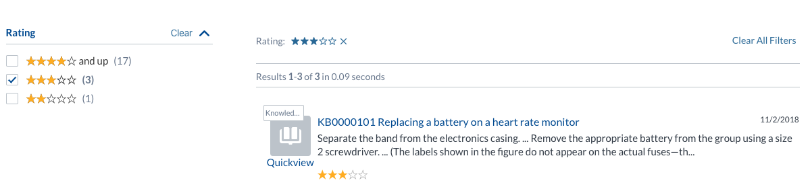
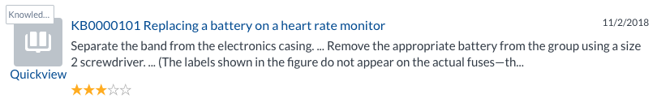
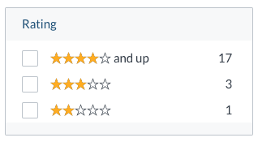
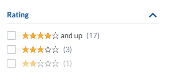

# Rating component



## Basic Usage

The CoveoRating component in a ResultTemplate component interface.

```
     <div class="CoveoRating" data-field="@rating"></div>
```



Full example:

```
      <div class="CoveoResultList">
        <script id="Default" class="result-template" type="text/html">
          <div class="coveo-result-frame">
            <div class="coveo-result-row">
              <div class="coveo-result-cell">
                <a class="CoveoResultLink"></a>
                <div class="CoveoRating"></div>
              </div>
            </div>
          </div>
        </script>
      </div>
```

## Options

Use `data-field="@fieldname"` to set the field with the rating value (usually a number from 1 to 5). The default field is _@ratings_.

## Facet styling




```
<div class="CoveoFacetRange ratings"
               id="RatingFacet"
               data-id="Rating"
               data-title="Rating"
               data-field="@ccratingaverage"
               data-number-of-values="4"
               data-custom-sort="4..99,3..3,2..2,1..1"
               data-ranges='[
                {"start": 1, "end": 2, "endInclusive": false, "label": "&bigstar;&star;&star;&star;&star;"},
                {"start": 2, "end": 3, "endInclusive": false, "label": "&bigstar;&bigstar;&star;&star;&star;"},
                {"start": 3, "end": 4, "endInclusive": false, "label": "&bigstar;&bigstar;&bigstar;&star;&star;"},
                {"start": 4, "end": 100, "endInclusive": false, "label": "&bigstar;&bigstar;&bigstar;&bigstar;&star; and up"}]'></div>
```

A sample of [SCSS](Rating.scss) is available to kickstart your own styling, using the class `ratings` with the `CoveoFacetRange`.

